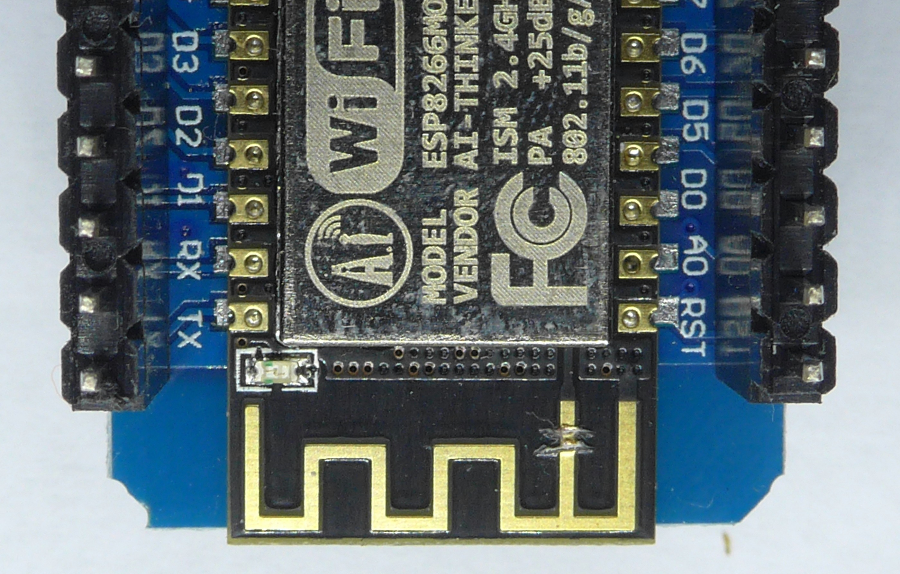
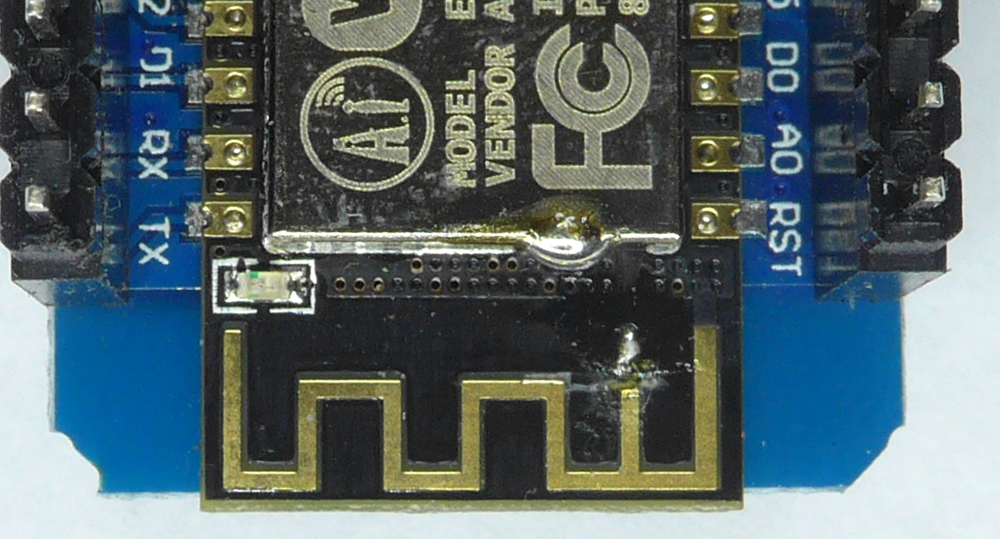
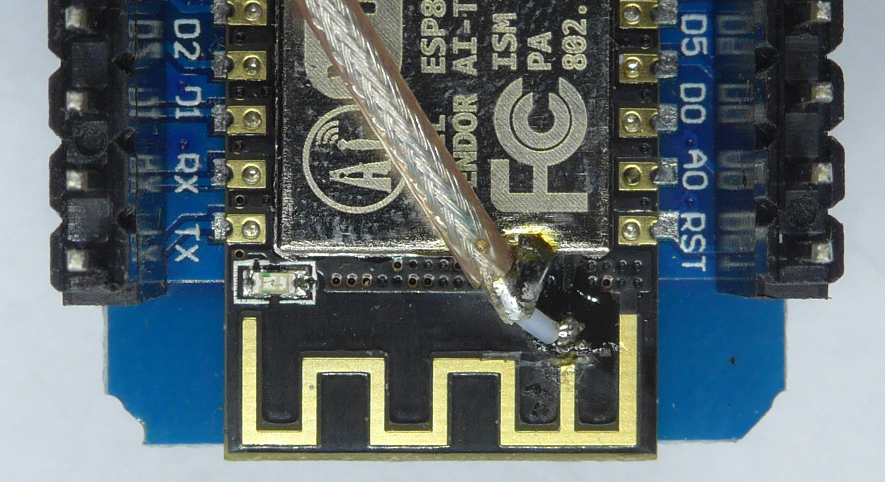
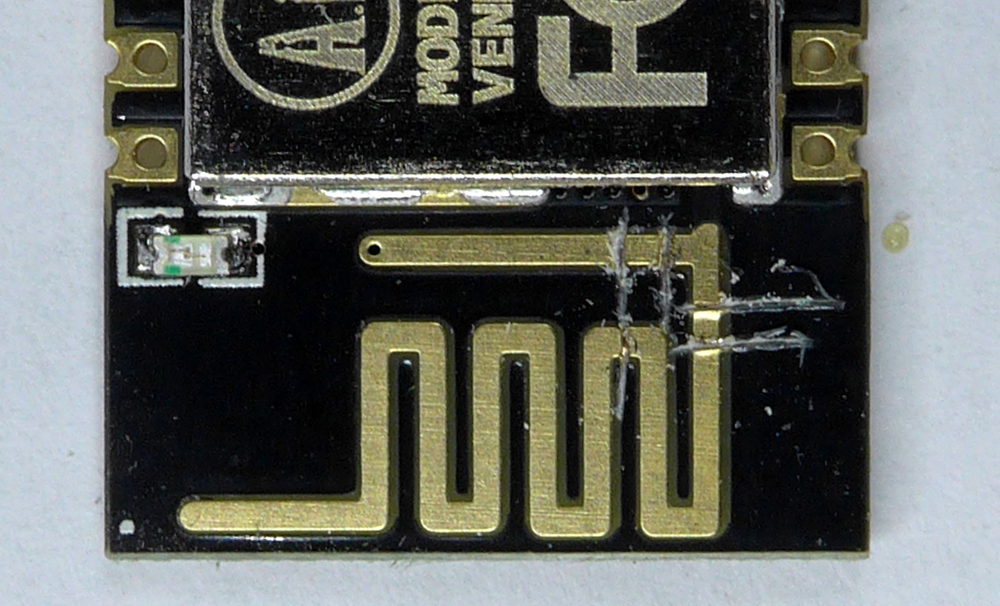
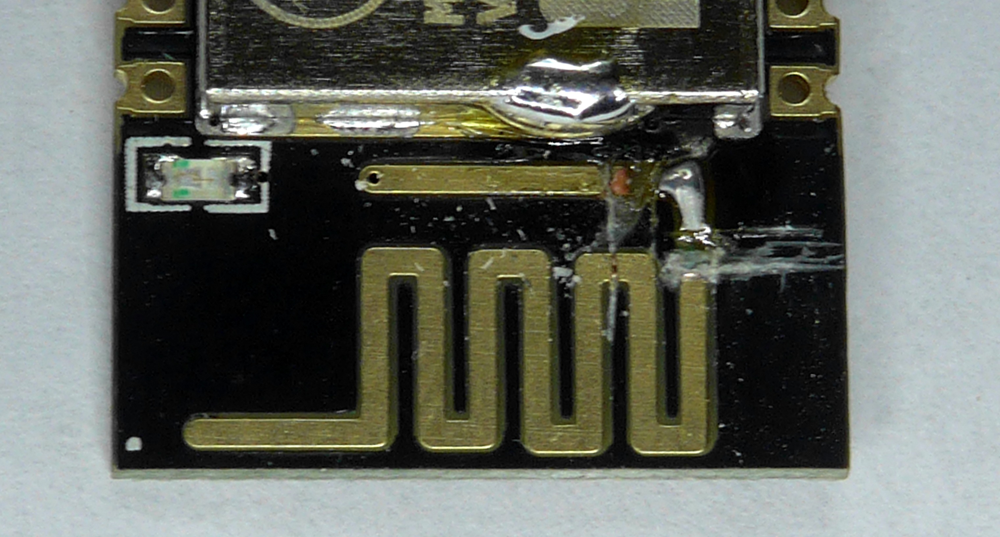
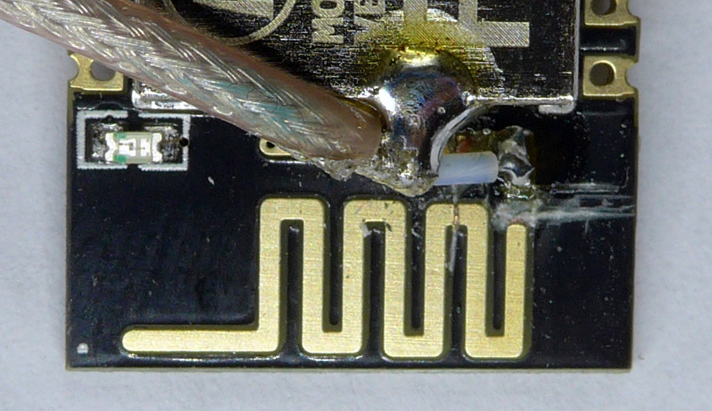

# ESP Tipps

## Kabel

Die Kabeldicke 22 AWG (0,32mm<sup>2</sup>) ist optimal zum Löten.

Steckverbinder gibt es unter dem Schlagwort JST zu finden. Die funktionieren auch wie die PSK Stecker mit den PINs (Crimpzange).

## Access Point

**Die Rogi Lösung ESP Master/Slave für die Absaugung, hat einen Access Point umgesetzt!**

<a href="https://arduino-esp8266.readthedocs.io/en/latest/esp8266wifi/soft-access-point-examples.html" target="_blank">https://arduino-esp8266.readthedocs.io/en/latest/esp8266wifi/soft-access-point-examples.html</a>

Es ist möglich den ESP als Soft Access Point aufzusetzen über:

???+ file ""
    <pre>WiFi.softAP("ESPsoftAP_01", "pass-to-soft-AP");</pre>

## Zusatzantenne

<a href="https://www.stall.biz/project/esp8266-esp12-mit-externer-wlan-antenne-fuer-wiffi-und-co" target="_blank">https://www.stall.biz/project/esp8266-esp12-mit-externer-wlan-antenne-fuer-wiffi-und-co</a>

__Achtung!!!__ Es gibt 2 Antennensteckerarten: _RP-SMA_ und _SMA_. Beim Kaufen aufpassen dass Stecker und Antenne vom gleichen Typ sind.

### NodeMCU Typ 1







### NodeMCU Typ 2







## Stromzähler auslesen

<a href="https://Volkszähler.de" target="_blank">Volkszähler.de</a>

<a href="https://haus-automatisierung.com/hardware/2021/09/25/infrarot-lesekopf-stromzaehler.html" target="_blank">Lesekopf Stromzähler</a>

Tasmota ohne eigene Entwicklungen! Daher nicht im eigneen Programmierungsverzeichnis.

Wemos D1 Gehäuse https://www.thingiverse.com/thing:1768820

EMH eHZM (im ersten PDF sind die Hex Werte wie im Script)  
<a href="../../attachments/eHZM-BIA-D-1-00.pdf" target="_blank">https://emh-metering.com/wp-content/uploads/2021/02/eHZM-BIA-D-1-00.pdf</a>  
<a href="https://emh-metering.com/wp-content/uploads/2021/02/eHZM-DAB-D-1-00.pdf" target="_blank">https://emh-metering.com/wp-content/uploads/2021/02/eHZM-DAB-D-1-00.pdf</a>    

In Config Namen anpassen

Tasmota feste IP über Konsole:
```
savedata 1
ipaddress1 192.168.1.60
savedata 0
```

```
>D
>B
=>sensor53 r
>M 1
+1,3,s,0,9600,GS303
1,77070100010800ff@1000,Total Consumed,KWh,Total_in,3
1,77070100100700ff@1,Current Consumption,W,Power_cur,0
1,77070100020800ff@1000,Total Delivered,KWh,Total_out,3
1,7707010060320101@#,Service ID,,Meter_id,0
#
```

Flag setzen "Enable Script". Am Besten mit DevTools offen, wegen Cache!

Zähler IR mit der Handy Cam anschauen, dann sieht man das Blinken.
Wenn die rechte LED blinkt, dann muss das Kabel nach oben geführt werden.

Watt Anzeige muss freigeschaltet werden. Dazu benötigt man die SmartMeter Pin vom Energieversorger.  
Einstellung mit Hilfe einer Taschenlampe.
Die Anleitung steht auch in dem <a href="../../attachments/eHZM-BIA-D-1-00.pdf" target="_blank">eHZM-BIA-D-1-00.pdf!</a>

Anbindung an FHEM über MQTT.
