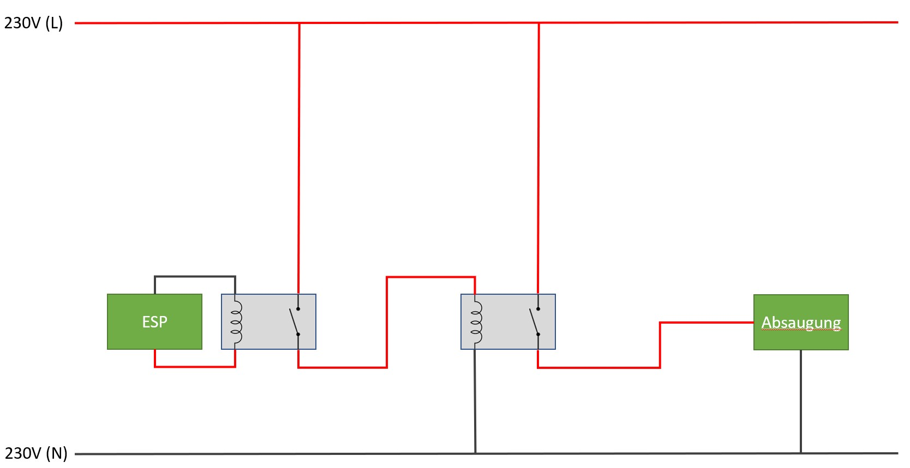

# ESP Sensoren

### Stromversorgung

Für kleinere Stromversorgungen ist der Sensor LM2596 

<a href="https://www.amazon.de/dp/B0823P6PW6" target="_blank">Sensor LM2596 geeignet</a>.  
Über die Schraube kann man Volt am Ausgang steuern.

Der ESP kann auch am 220V Netz betrieben werden über die HI-LINK Power Sensoren.  

__Achtung!!!__ Es gibt 2 Varianten für <a href="https://www.amazon.de/dp/B07V9JFTSQ/" target="_blank">3,5V (evtl. auch HLK-PM03)</a> und <a href="https://www.amazon.de/dp/B07V7GHK51/" target="_blank">5V (evtl. auch HLK-PM01)</a> Stromversorgung!

Die Stromversorgung muss gegen Spannungsspitzen abgesichert werden.  
Einmal sollte ein Störfiltermodul (Spulen mit Transistoren) zur Stabilisierung vorgeschaltet werden: <a href="https://www.reichelt.de/at/de/entstoerfilter-pcb-montage-0-6-a-ffp-01-55002000-p124010.html?ACTION=3&GROUPID=7485&ARTICLE=124010&START=0&OFFSET=16&" target="_blank">Reichelt Entstörfilter PCB-Montage (4,24€)</a>  
Hierzu ist zusätzlich ein Varistor geeignet: <a href="https://www.reichelt.de/at/de/varistor-rm-5-mm-250-v-10--epc-b72205-s-252-p239898.html" target="_blank">Reichelt Varistor B72205-S 25 (0,20€)</a>

### Hochlastrelais

<a href="https://www.reichelt.de/at/de/varistor-rm-5-mm-250-v-10--epc-b72205-s-252-p239898.html" target="_blank">Leistungsrelais 30A - FIN 66.82.8 230V (13,50€)</a>

### Strommessung

<a href="https://www.geekering.com/categories/embedded-sytems/esp8266/ricardocarreira/esp8266-nodemcu-simple-energy-meter-using-pzem004t/" target="_blank">https://www.geekering.com/categories/embedded-sytems/esp8266/ricardocarreira/esp8266-nodemcu-simple-energy-meter-using-pzem004t/</a>

Die Strommessung erfolgt über den <a href="https://www.amazon.de/dp/B08D7PTJ7D/" target="_blank">PZEM-004T Version 3 zusammen mit CT (100A)</a>.

